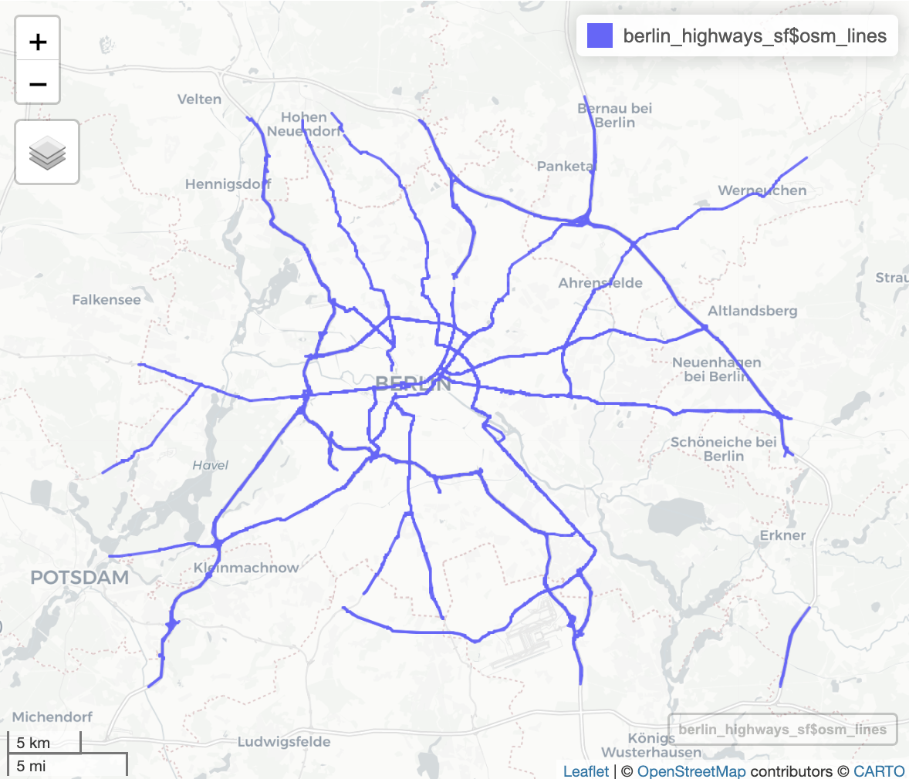
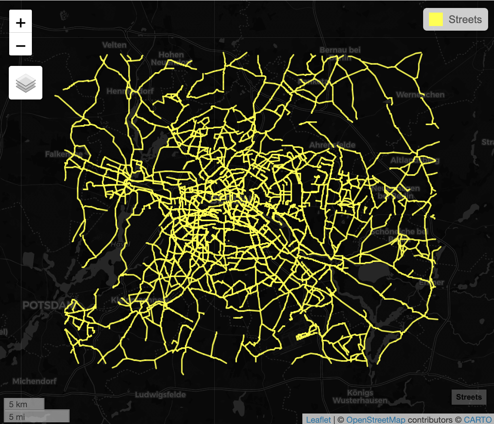
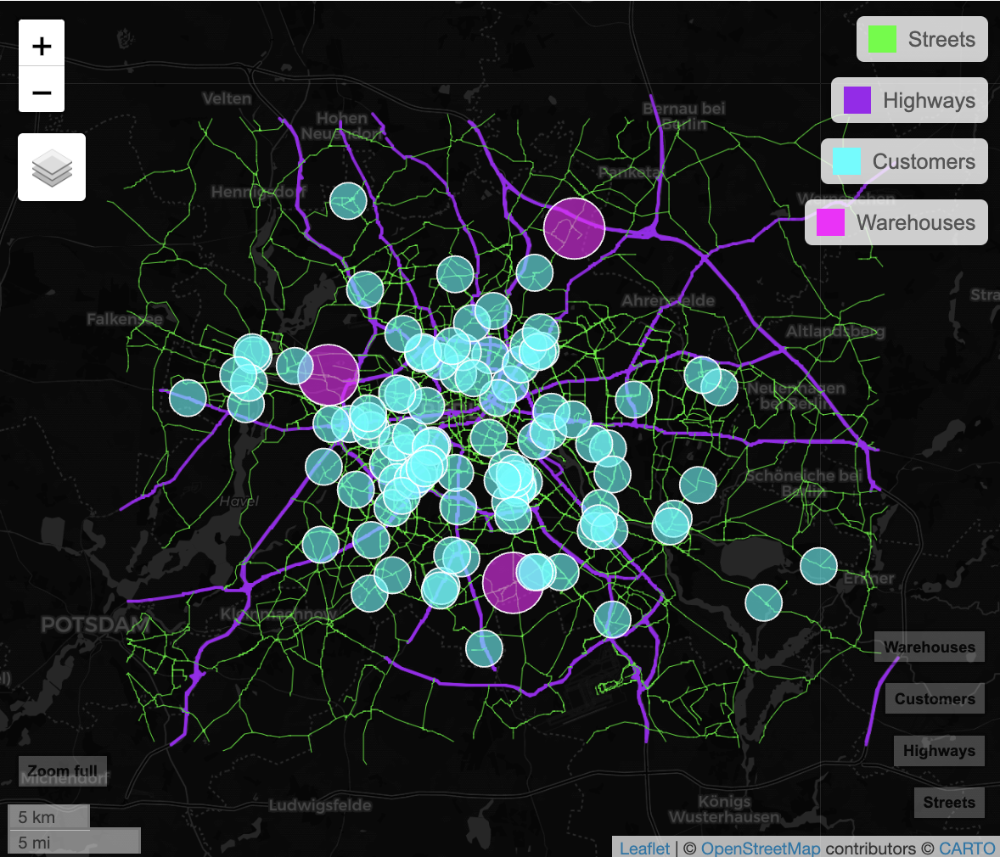
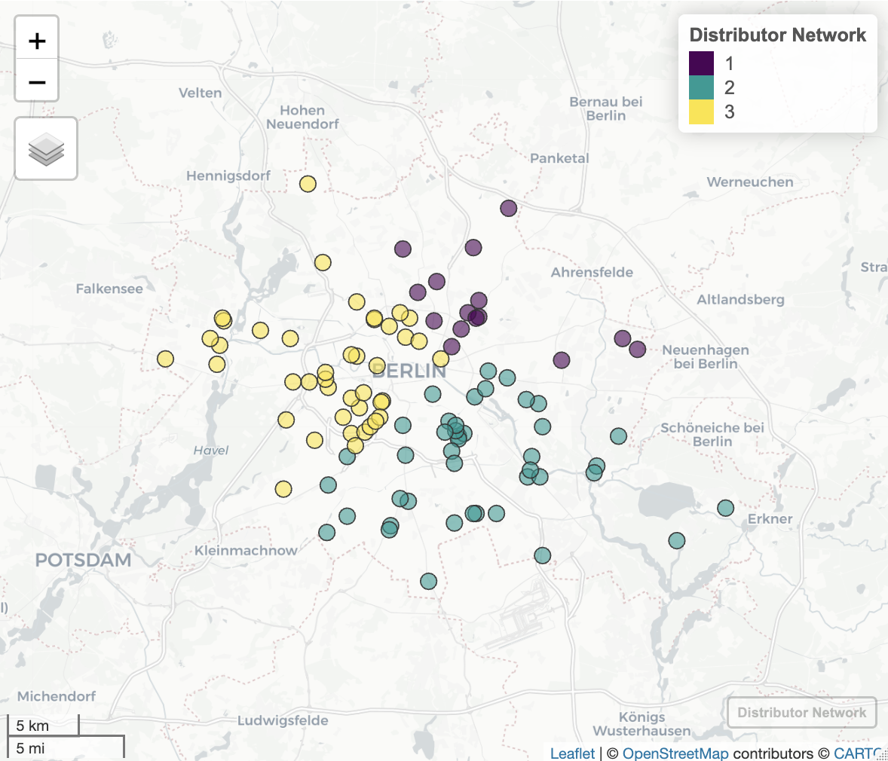
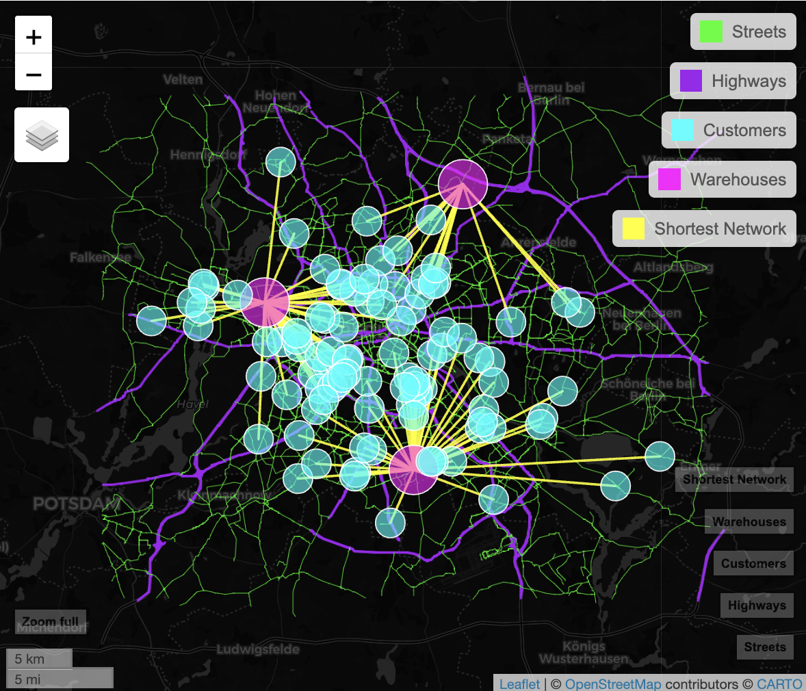
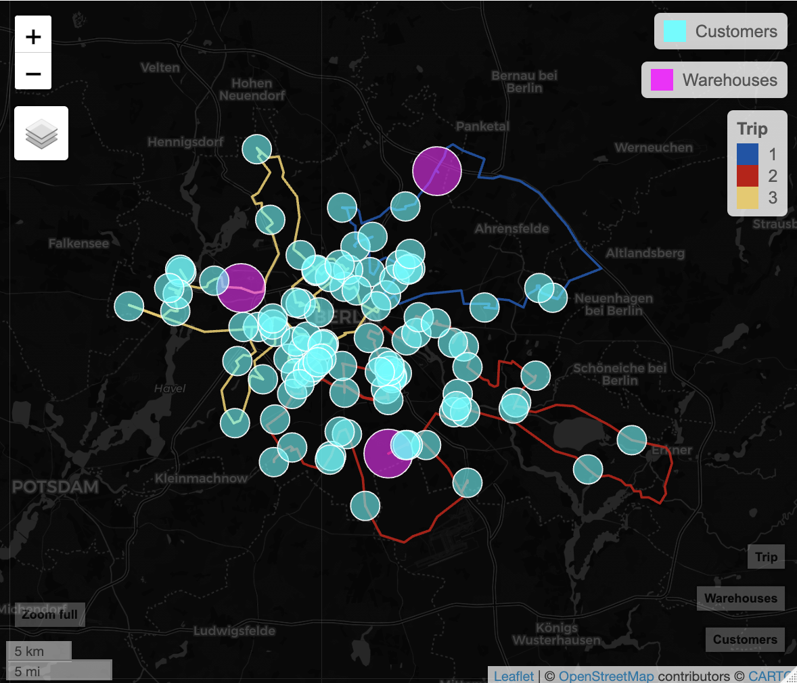

# geospatial_analysis_r

### Business Problem
Reducing transportation costs

The company X distributes food to restaurants. And, it makes runs weekly or sometimes daily for perishable items. The task is solve this problem or significantly reduce risk by answearing the question:
How do you know which grocery warehouse to supply which restaurant?

##### Plot highways in the research city

##### Plot streets in the research city

##### Plot highways/streets/customers/warehouses in the research city

##### Plot distributor network in the research city

##### Plot shortest network in the research city

##### Plot Trip Routes in the research city (Solution)

##### Estimating trip cost ----

| Distributor to |  Duration  | Distance | Driver cost per trip | Fuel cost per km | Total cost |
|:---------------|:----------:|:--------:|:--------------------:|:----------------:|-----------:|
| **1**          |     117.   |   74.4   |          500         |        12        |      $1393 |
| **2**          |     265.   |   152.   |          500         |        12        |      $2329 |
| **3**          |     234.   |   123.   |          500         |        12        |      $1978 |

##### Conclusion
The organization is able to better select routes for distributors.

### (Dev) Run code locally
- `renv::restore(lockfile = 'renv.lock')`
- snaphot your env: `Rscript snapshot_env.R`
